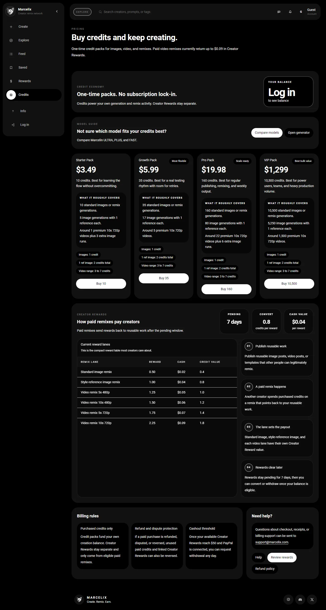

<p align="center">
  
</p>

<h1 align="center">Marcelix</h1>

<p align="center">
  <strong>An AI-native social network for reusable images, videos, and remix chains.</strong>
</p>

<p align="center">
  Live product: <a href="https://www.marcelix.com">marcelix.com</a>
</p>

---

Marcelix is a consumer product, not a framework.

This repo is meant to explain the product thesis and show the public surface area clearly, without disclosing the private operating details that make the network work.

## The thesis

Most AI image and video products end at generation.

You prompt, render, export, post somewhere else, and start over.

That creates a dead-end workflow:

```text
prompt -> output -> download -> post -> disappear
```

Marcelix is built around a different assumption:

> the next AI-native social platform should not be a gallery of dead exports  
> it should be a network of reusable creative states

In Marcelix, a strong image or video is not just something to look at.

It can become:

- a public post
- a reusable template
- a remix source
- an attribution root
- a profile growth engine
- a reward-generating asset when downstream remixes happen

That changes the loop from:

```text
generate -> post -> hope for likes
```

to:

```text
generate -> publish -> remix -> attribution -> rewards -> stronger distribution
```

## What Marcelix is actually doing

Marcelix combines five things that are usually scattered across different products:

- AI image generation
- AI video generation
- public creator profiles and feeds
- reusable remixable posts
- creator rewards tied to downstream usage

The product is opinionated around one idea:

> useful creative work should stay alive after first publish

Today, most creators either:

- give away prompts for free to farm attention
- send people to affiliate links for tiny payouts
- post outputs that other people manually copy without attribution

Marcelix tries to make the remix path native instead.

If a creator publishes something reusable and someone else remixes it inside the network, the source relationship is preserved inside the product rather than lost in screenshots, copied prompts, or off-platform reposts.

## What exists in the product today

Publicly visible product primitives include:

- private draft generation for images and videos
- public post pages with shareable slugs
- reusable posts that can become remix sources
- prompt visibility controls
- attribution preserved across remix chains
- creator profiles that accumulate followers, posts, and remix activity
- creator rewards tied to eligible downstream reuse
- credit-based generation for image and video workflows

## The core object model

Marcelix is not organized around "a prompt feed."

It is organized around a small set of product primitives:

### 1. Private drafts

Every generation starts private.

That gives creators a place to:

- test prompts
- compare outputs
- keep unfinished work out of the public feed
- choose whether prompt text should ever be public

### 2. Public posts

A post is the public distribution surface.

It carries:

- media
- title
- description
- tags
- creator identity
- remixability
- visibility rules

### 3. Reusable templates

A reusable post is not just "liked content."

It is content that another creator can actually build from.

This is where Marcelix stops behaving like a normal AI gallery and starts behaving more like a creative graph.

### 4. Remix chains

When a remix happens, the downstream work remains linked back to the upstream source.

That enables:

- attribution
- template analytics
- creator profile growth
- rewards tied to usage instead of only raw impressions

## Why prompt privacy matters

One of the hard product problems here is that creators want two things at once:

- public distribution
- private recipes

Marcelix treats prompt privacy as a first-class product primitive instead of an afterthought.

For original posts, creators can choose whether prompts are public or hidden.

For remix posts, prompt text stays protected automatically.

That means the public object is still discoverable through:

- visuals
- title
- description
- tags
- creator identity

without requiring creators to leak the exact text stack that produced the result.

This matters because prompt sharing is not the only legitimate way to participate in generative culture. Sometimes the value is in teaching openly. Sometimes the value is in publishing the result while keeping the recipe private.

Marcelix supports both.

## Why this is different from prompt marketplaces

Prompt marketplaces mostly treat prompts as the product.

Marcelix treats reuse as the product.

That sounds subtle, but it changes almost everything:

- the primary public unit is the result, not the raw prompt
- remixing happens inside the network, not through copied text
- attribution survives downstream usage
- creator rewards can be tied to actual reuse activity
- images and videos live in the same social and economic loop

The bet is that AI-native social media will look less like "prompt dumping" and more like a reusable graph of creative transformations.

## Images and videos share the same loop

Marcelix is built for both images and short videos.

That matters because most tools still split those into separate products, separate communities, or separate monetization paths.

Here, both can participate in the same creator loop:

```text
private draft -> public post -> reusable source -> remix -> reward
```

That lets a creator build a profile around:

- static image templates
- short video templates
- meme formats
- cinematic loops
- aesthetic transformations
- character or product remixes

without fragmenting their identity across different tools.

## What earns attention here

Marcelix is not designed around "upload more."

It is designed around making things other people want to reuse.

The strongest posts usually do one or more of these well:

- instantly communicate a transformation
- make the viewer imagine themselves in the template
- map cleanly to a current internet format or meme
- work as a profile-picture, poster, edit, intro clip, or aesthetic upgrade
- keep enough context public even when the prompt stays hidden

This leads to a different creator strategy:

- not just "make beautiful outputs"
- but "make reusable outputs with strong downstream demand"

## Creator economics

The reward model is intentionally downstream-focused.

At a high level:

1. A creator publishes reusable work.
2. Another creator remixes it.
3. If that remix is eligible, the source creator can accrue Creator Rewards.
4. Rewards clear later and can be used in supported ways inside the product.

The important design point is not the exact rate.

The important design point is that value is tied to reuse, not just impression farming.

That is a more interesting primitive than:

- posting prompts for free and hoping for followers
- stuffing affiliate links into bios
- getting copied without any native attribution path

## Product surfaces

### Explore feed

The feed is not just a gallery. It is a discovery surface for reusable creative work.


### Pricing and rewards surface

Credit packs and creator rewards are visible in the product, but the README intentionally avoids exposing private internal economics beyond what is public in the app.



### Public post and remix surface

A public post can act as both a media page and a reusable upstream source.


## Why this can become a real network

A normal AI app produces outputs.

A social app produces attention.

Marcelix is trying to produce compounding creative reuse.

That means one good post can do more than collect likes:

- it can pull in followers
- it can become a template
- it can travel off-platform and pull people back in
- it can generate a remix thread
- it can keep paying attention back to the original creator

If that works, the network gets stronger as reusable content accumulates.

## What this public repo intentionally does not disclose

This repository is public-facing on purpose, but it is not a blueprint for cloning the private parts of the system.

So this README does **not** include:

- ranking weights
- anti-abuse logic
- fraud thresholds
- exact reward formulas
- provider mix
- internal moderation heuristics
- infrastructure details
- proprietary growth or economics tuning

The goal is to explain the product clearly without handing competitors the private operating details.

## In one sentence

Marcelix is a bet that AI-generated media should not end as disposable files.

It should become reusable social objects that can be remixed, attributed, discovered, and economically connected back to the creator who started the chain.

## Links

- Product: <a href="https://www.marcelix.com">marcelix.com</a>
- Explore feed: <a href="https://www.marcelix.com">marcelix.com</a>
- Pricing: <a href="https://www.marcelix.com/pricing">marcelix.com/pricing</a>
