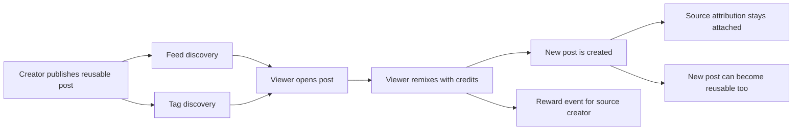

<p align="center">
  <a href="https://www.marcelix.com">
    
  </a>
</p>

<h1 align="center"><a href="https://www.marcelix.com">Marcelix</a></h1>

<p align="center">
  <strong>A remix-native publishing layer for AI images and videos.</strong>
</p>

<p align="center">
  <a href="https://www.marcelix.com">Open Marcelix</a>
  ·
  <a href="https://www.marcelix.com/creator-rewards">Creator rewards</a>
  ·
  <a href="https://www.marcelix.com/support">Support</a>
</p>

---

## What This Repo Is

This is the public product note for [Marcelix].

It documents the user-facing mechanics: public posts, reusable sources, tags, remix paths, prompt privacy, creator rewards, and payout surfaces.

It is not the production source repo. It covers the public mechanics and leaves operational playbooks out of scope.

The live product is here:

- <a href="https://www.marcelix.com">marcelix.com</a>

## The Short Version

Most AI media is published as a flat file.

[Marcelix] publishes it as an object that can keep working after the first upload:

```text
AI post =
  generated media
  + creator attribution
  + reusable state
  + prompt privacy choice
  + tags
  + remix entry point
  + creator reward lane
```

If a viewer likes a post, they can remix from it directly. The source creator stays attached to the chain, and paid remixes create reward events under the public reward rules.

That is the product: not "share a prompt and hope someone remembers you," but a native remix path where the source remains part of the object.

## Start With A Real Post

Open this public post:

- [cartoon trailer - The blue Cat](https://www.marcelix.com/post/fa85a896d0d2/hajareddal-cartoon-trailer-the-blue-cat)

What to look for:

- the media is the visible artifact
- the creator profile is one click away
- the post can be a remix entry point
- attribution stays connected to the source

That is the unit Marcelix is built around.

## Core Loop



The loop is intentionally small:

```text
publish reusable work -> get discovered -> get remixed -> keep the source attached
```

The interesting part is that discovery, reuse, attribution, and rewards are not separate hacks. They live on the same post object.

## The Design Split

HN readers usually notice this part first: a remix product fails if publishing, reuse, and prompt exposure all mean the same thing.

[Marcelix] keeps them separate.

| Choice | What the creator controls |
| --- | --- |
| Public | Whether the post appears on public surfaces such as profile, feed, tags, and links. |
| Reusable | Whether other users can start a remix from this post. |
| Prompt visibility | Whether prompt text is public or hidden from public post/template surfaces. |
| Tags | Which public discovery surfaces the post joins. |
| Reward lane | Which public reward lane applies when the source is remixed with paid credits. |

That separation is the product. A creator can publish without opening remix. A creator can open remix without dumping the full hidden prompt. A creator can use tags for discovery without turning the post into a generic prompt marketplace listing.

## Why Tags Matter

Tags in [Marcelix] are not decorative metadata.

They are small distribution surfaces:

```text
tag -> niche page -> search/follow/click activity -> creator attribution -> profile discovery
```

When the network is young, a useful tag can become free profile marketing for the creator who established it. A good tag can name a style, format, character world, visual trope, or remix trend before the category gets crowded.

[Marcelix] keeps editorial control over public tag surfaces so the tag system can stay useful instead of becoming pure spam or squatting.

## Prompt Privacy

The strongest creators do not always want to publish the entire recipe behind a post.

The public contract is:

- a post can be public while its prompt stays hidden
- a post can be reusable without showing the full source prompt
- remixers work from their own remix-side context
- hidden prompts are not displayed as public discovery surfaces

That makes remixing practical without turning every strong post into a public prompt dump.

## Creator Rewards

Creator rewards are tied to paid reuse, not views or likes.

Creator-facing model:

```ts
// Illustrative product model, not production code.
if (
  sourcePost.reusable &&
  remix.usesPaidCredits &&
  remix.creatorId !== sourcePost.creatorId &&
  remix.passesRewardRules
) {
  createRewardEvent({
    creatorId: sourcePost.creatorId,
    lane: remix.rewardLane,
    sourcePostId: sourcePost.id,
    remixPostId: remix.id,
  })
}
```

Current public reward lanes:

| Paid remix lane | Creator Reward | Cash value | Credit value |
| --- | ---: | ---: | ---: |
| Standard image remix | 0.50 | $0.02 | 0.4 credits |
| Style-reference image remix | 1.00 | $0.04 | 0.8 credits |
| Video remix 5s 480p | 1.25 | $0.05 | 1.0 credits |
| Video remix 10s 480p | 1.50 | $0.06 | 1.2 credits |
| Video remix 5s 720p | 1.75 | $0.07 | 1.4 credits |
| Video remix 10s 720p | 2.25 | $0.09 | 1.8 credits |

What does not count:

- self-remixes
- promo-only credit activity
- private drafts
- posts that are public but not reusable
- refunded, disputed, reversed, or abuse-reviewed activity

After rewards clear the pending window, creators can convert them into credits or request PayPal payout from the reward area in the app.

Live reward page:

- <a href="https://www.marcelix.com/creator-rewards">marcelix.com/creator-rewards</a>

## Model Lanes

[Marcelix] uses external generation providers behind product-facing model lanes.

That is the honest version: Marcelix is not pretending to be a foundation-model lab. The product value is in the creation workflow, remix graph, privacy boundary, post object, discovery layer, and reward system.

The model page exposes the creator-facing lanes:

| Lane | Best for |
| --- | --- |
| Fast image | quick concepts, iteration, prompt testing |
| Polished image | stronger final posts and reusable sources |
| Reference-guided image | style, pose, structure, outfit, mood, and composition control |
| Short video | motion posts, teasers, character moments, remixable clips |
| Higher-end video | sharper video output when polish matters more than speed |

Creator-facing names can stay stable while the generation layer improves behind them.

Current model page:

- <a href="https://www.marcelix.com/models">marcelix.com/models</a>

## Screens

### Explore


The explore feed is where public posts, tags, creators, and reusable sources meet. This is the discovery layer, not just a gallery.

### Post Page


The post page is the main object: media, creator, attribution, and remix action in one place.

### Rewards


The reward page shows the public earning lanes, conversion path, payout path, and the rules for what counts.

## What Makes It Different

The bet is not that AI generation alone is scarce.

The scarce part is the network object around the generation:

- who made it
- whether it can be reused
- what stays private
- what tag surface it belongs to
- who gets attributed downstream
- how paid remixes map back to the source creator

That is why [Marcelix] is built around reusable posts instead of exported assets.

For a creator, the practical version is simple:

```text
make strong AI media
publish it as reusable
let people discover it through feeds and tags
let them remix directly
keep attribution and reward events tied to the source
```

## More Detail

- [Architecture note](./docs/architecture.md)
- [Creator rewards and payouts note](./docs/rewards-and-payouts.md)
- [Discovery, tags, and moderation note](./docs/discovery-tags-and-moderation.md)
- [Prompt privacy and model layers note](./docs/prompt-privacy-and-model-layers.md)
- [Security](./SECURITY.md)

## Public Links

- Product: <a href="https://www.marcelix.com">marcelix.com</a>
- Creator Rewards: <a href="https://www.marcelix.com/creator-rewards">marcelix.com/creator-rewards</a>
- Creator Rewards Policy: <a href="https://www.marcelix.com/creator-rewards-policy">marcelix.com/creator-rewards-policy</a>
- Help: <a href="https://www.marcelix.com/help">marcelix.com/help</a>
- Support: <a href="https://www.marcelix.com/support">marcelix.com/support</a>
- Models: <a href="https://www.marcelix.com/models">marcelix.com/models</a>
- Privacy: <a href="https://www.marcelix.com/privacy">marcelix.com/privacy</a>
- Terms: <a href="https://www.marcelix.com/terms">marcelix.com/terms</a>

[Marcelix]: https://www.marcelix.com
