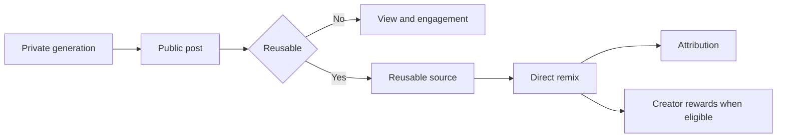

<p align="center">
  <a href="https://www.marcelix.com">
    
  </a>
</p>

<h1 align="center"><a href="https://www.marcelix.com">Marcelix</a></h1>

<p align="center">
  <strong>An AI-native social network for reusable images, short videos, remix chains, and creator rewards.</strong>
</p>

<p align="center">
  <a href="https://www.marcelix.com">marcelix.com</a>
</p>

---

Most AI apps stop at generation.

A creator can post AI work to a mainstream feed, get 50k views, and still come away with almost nothing durable: no remix path, no attribution trail, no way for the next creator to build from it inside the same network, and no clean connection between downstream use and the original creator.

[Marcelix] is built around a different unit:

> a public post that can remain alive inside the network as a reusable source

That changes the loop from:

```text
prompt -> output -> download -> repost -> disappear
```

to:

```text
private generation -> public post -> reusable source -> remix -> attribution -> creator upside
```

This repository is a public product brief for [Marcelix].

It focuses on the stable creator-facing contract:

- what the main objects are
- how discovery and remixing work at a product level
- how prompt privacy works at a product level
- how creator rewards fit into the network

## What This Repo Is Not

This repo is intentionally not:

- the source code for Marcelix
- the legal terms or policy pages themselves
- a public developer API
- a provider integration guide
- a full internal architecture or abuse-prevention manual

The goal is to explain the product clearly enough to build trust, without turning the repo into a cloning guide or an operational map.

## What [Marcelix] Is

[Marcelix] is designed around a simple idea:

- creators generate images or short videos privately
- they publish the strongest work publicly
- some posts become reusable remix sources
- other users can remix those sources directly inside the product
- attribution stays attached to the source
- eligible paid remix activity creates creator rewards

The public post is the main social object.

Not the raw prompt.
Not the provider request.
Not the exported file.

## Core Loop



Here is a live public example of the product object this repo is talking about:

- [cartoon trailer - The blue Cat](https://www.marcelix.com/post/fa85a896d0d2/hajareddal-cartoon-trailer-the-blue-cat)

## A Concrete Creator Loop

This is easier to understand through a concrete example than through abstract product language.

Suppose a creator publishes a reusable cartoon trailer or stylized short video in a niche that still feels early.

If the post gets picked up in `For You`, `Trending`, or tag discovery, some viewers follow the creator. One of those viewers can then remix the post directly inside [Marcelix] instead of exporting it and breaking the chain somewhere else.

The remix still points back to the original source. The original creator stays attached. When that downstream remix uses eligible paid credits and stays valid, the source creator earns Creator Rewards from that reuse.

That is the core difference between a post that only gets attention and a post that keeps creating value after publication.

## Discovery And Growth

[Marcelix] has three public feed surfaces:

- `For You`
- `Trending`
- `Following`

They solve different problems.

- `For You` is the main growth surface. It mixes social intent, creative relevance, reusable quality, freshness, and broader discovery.
- `Trending` is about current movement, not only historical size.
- `Following` starts from creators and tags the viewer already chose, then stays usable by widening when needed.

The exact internal ranking controls are not the public contract.

The public contract is simpler:

- the network should help strong work get discovered
- the feed should not collapse into low-quality repetition
- remixable supply matters more than empty activity
- creators should be able to grow without already being large

That matters because creator growth in [Marcelix] is not supposed to depend only on an existing audience. A creator can grow by publishing work that is:

- strong enough to get suggested
- clear enough to establish a style or niche
- reusable enough to create downstream demand

## Tags Are Part Of Discovery

Tags in [Marcelix] are not only labels.

They are discovery surfaces:

- users can add them to posts
- users can search them directly
- users can follow them directly
- tag pages can concentrate a niche

Creator-originated tags matter especially in a young network.

If a creator establishes a useful tag early, that tag can route attention back to the creator profile whenever other users search, follow, or explore that niche. The product can show attribution such as `Created by @username` where that helps users understand the origin of the tag.

That makes tags part of creator distribution, not just metadata.

## What Reusable Means

`Reusable` is a concrete product state in [Marcelix].

At a public level, it means:

- the post is public
- the post is visible
- remix is enabled for that post
- another user can create a new generation from that source inside the product

It does **not** mean every part of the original workflow becomes public.

Reusable does not automatically expose:

- hidden prompts
- private drafts
- private edit history
- provider metadata
- internal generation context

It means the work can function as an upstream source inside the network.

## What Creators Keep

At a product level, [Marcelix] keeps four things connected:

- the creator identity
- the public post
- the reusable source
- the downstream remix path

That means creators are not forced to choose between publishing publicly and losing all future connection to the work once it starts moving.

The product is designed so that strong reusable work can keep pulling:

- more discovery
- more followers
- more remixes
- more creator rewards

## Prompt Privacy

Prompt privacy is one of the core product promises in [Marcelix], but the promise is specific.

The public contract is:

- original posts can publish prompts as `public` or `hidden`
- hidden prompts are removed from the public post and reusable template surfaces
- remix prompts are private by default
- remixers see their own remix-side edits, not the source creator's full hidden baseline
- hidden prompt text is not a public discovery surface

This is a visibility and access-control promise.

It is not a claim that hosted generation happens without external model providers or without operational systems.

## Creator Rewards

Creator Rewards are the incentive layer that connects reusable supply to downstream paid reuse.

The creator-facing contract is:

- every eligible paid remix creates creator rewards for the reusable source creator
- self-remixes do not count
- promo-only activity does not create stable withdrawable value
- private drafts and non-reusable public posts do not qualify
- refunded, disputed, reversed, or abuse-reviewed activity can be corrected or removed

Rewards are attached to the reusable source that was actually remixed.

Creator Rewards are not wages, salary, or guaranteed income.

They are a platform incentive funded by eligible paid reuse inside the product.

### Reward logic, shortly

1. Publish reusable work.
2. Another user remixes it with paid credits inside [Marcelix].
3. The reusable source creator earns Creator Rewards.
4. The reward lane depends on the remix lane.
5. After the pending window, rewards move into conversion or payout flow under the public rules shown in the product.

### Current reward lanes

| Remix lane | Creator Reward | Cash value | Credit value |
| --- | ---: | ---: | ---: |
| Standard image remix | 0.50 | $0.02 | 0.4 credits |
| Style-reference image remix | 1.00 | $0.04 | 0.8 credits |
| Video remix 5s 480p | 1.25 | $0.05 | 1.0 credits |
| Video remix 10s 480p | 1.50 | $0.06 | 1.2 credits |
| Video remix 5s 720p | 1.75 | $0.07 | 1.4 credits |
| Video remix 10s 720p | 2.25 | $0.09 | 1.8 credits |

The live rewards page explains the pending window, conversion, payout, and reversal rules in full.

## Conversion And Cashout

[Marcelix] lets creators use reward value in two ways:

- convert eligible rewards into in-product credits
- request payout when the account, product rules, reserve checks, and provider requirements are satisfied

The live numbers, waiting windows, thresholds, and policy requirements are surfaced in the product and public policy pages rather than frozen in this repo.

## Model Layer

`Marcelin` and `Video Galaxy` are product-facing lane names in [Marcelix].

That means:

- the names are the stable user surface
- the provider mix behind them can change
- the product contract is lane behavior, not upstream provider identity

[Marcelix] uses leading external image and video providers behind a product-controlled model layer.

The important public point is that the user-facing lanes stay stable even as the provider layer evolves over time.

## Public Commitments

These are the commitments the public product experience is built around:

- drafts stay private until a creator publishes them
- hidden prompts stay off public post and template surfaces
- reusable does not mean full workflow disclosure
- attribution stays attached to in-product remix paths
- creator rewards are tied to eligible paid reuse, not vague engagement
- support, policy, and safety surfaces are public and reachable

## Trust Surfaces

Trust is not only policy text. In [Marcelix], it also means public product surfaces that explain how the network behaves:

- support form for account, billing, payout, and abuse issues
- help center for creator-facing usage questions
- creator rewards page and policy
- privacy, terms, refunds, and acceptable-use pages
- public security reporting instructions

## Public Surfaces

### Explore

The home feed is the discovery and reuse surface.


This is the first distribution layer. The important thing is not only that posts are visible here, but that the feed is designed to route attention toward work that can continue living inside the network.

### Post page

A post page in [Marcelix] is both distribution and an upstream remix node.


This is the remix entry point. The viewer remixes directly from the post, and the original creator stays attached automatically instead of losing attribution across exports and reposts.

### Rewards

[Marcelix] exposes creator reward information, payout rules, and creator-side actions directly in the product.


This is where the economic side becomes concrete for creators: reward value, conversion to credits, payout readiness, and the creator-facing rules all live in the product instead of being hidden behind a vague promise.

## Public Docs In This Repo

- [Architecture note](./docs/architecture.md)
- [Creator rewards and payouts note](./docs/rewards-and-payouts.md)
- [Discovery, tags, and moderation note](./docs/discovery-tags-and-moderation.md)
- [Prompt privacy and model layers note](./docs/prompt-privacy-and-model-layers.md)
- [Security](./SECURITY.md)

## Links

- Product: <a href="https://www.marcelix.com">marcelix.com</a>
- Creator Rewards: <a href="https://www.marcelix.com/creator-rewards">marcelix.com/creator-rewards</a>
- Creator Rewards Policy: <a href="https://www.marcelix.com/creator-rewards-policy">marcelix.com/creator-rewards-policy</a>
- Help: <a href="https://www.marcelix.com/help">marcelix.com/help</a>
- Support: <a href="https://www.marcelix.com/support">marcelix.com/support</a>
- Models: <a href="https://www.marcelix.com/models">marcelix.com/models</a>
- Privacy: <a href="https://www.marcelix.com/privacy">marcelix.com/privacy</a>
- Terms: <a href="https://www.marcelix.com/terms">marcelix.com/terms</a>

[Marcelix]: https://www.marcelix.com
