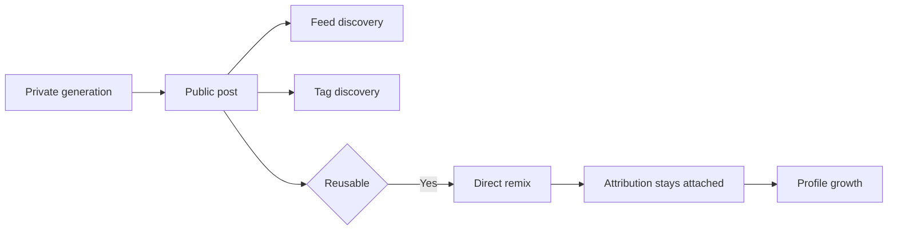

<p align="center">
  <a href="https://www.marcelix.com">
    
  </a>
</p>

<h1 align="center"><a href="https://www.marcelix.com">Marcelix</a></h1>

<p align="center">
  <strong>Create. Remix. Earn.</strong>
</p>

<p align="center">
  <a href="https://www.marcelix.com">marcelix.com</a>
</p>

---

AI tools got very good at making images and videos.

They are still bad at helping creators keep the upside.

A creator can make a great AI post, throw it on a mainstream feed, get 50k views, and still leave with nothing durable: no remix path, no attribution chain, no real way for the next creator to build from it, and no clean way to turn strong source work into profile growth.

[Marcelix] is built around one idea:

> a post should stay useful after it is published

Not as a file people export and forget.

As a reusable source inside the network.

## Open A Real Post

If you want to see the product object this README is talking about, open a real post:

- [cartoon trailer - The blue Cat](https://www.marcelix.com/post/fa85a896d0d2/hajareddal-cartoon-trailer-the-blue-cat)

That page is the actual unit of the network: public media, attribution, remix entry point, and creator profile growth all tied together in one place.

## What Actually Happens



The important shift is simple:

```ts
if (post.isPublic) {
  distribute(post)
}

if (post.isReusable) {
  allowDirectRemix(post)
  keepSourceAttached(post)
}
```

That is the core difference between a post that gets seen once and a post that keeps doing work after publication.

## Why This Is Better For Creators

In [Marcelix], a strong post can do three jobs at once:

1. get discovered in the feed
2. turn viewers into followers
3. become a starting point for direct remixes

That matters because the best post in a creator account should not die as a one-off upload. It should keep pulling people into the profile and keep creating downstream activity.

## The Post Is The Main Object

The important object in [Marcelix] is not the raw prompt and not the exported asset.

It is the public post.

Once a post is reusable:

- other creators can build from it directly inside the product
- the source stays attached
- the remix stays inside the graph
- the original creator does not disappear the moment someone else uses the work

That sounds obvious. Most AI apps still do not work this way.

## Three Product Decisions That Matter

### 1. Public does not automatically mean reusable

A creator can publish something publicly without turning it into upstream material for everyone else.

That keeps publishing and reuse as two separate choices.

### 2. Reusable does not automatically mean prompt leakage

[Marcelix] keeps remixability and prompt exposure separate.

A creator can let people build from the work without dumping the full hidden workflow on the public surface.

That is one of the main reasons remix can be useful here without turning into a race to leak prompts.

### 3. Tags are distribution, not decoration

Tags are not dead metadata in [Marcelix].

They are:

- search surfaces
- follow surfaces
- niche entry points
- creator distribution channels

In a young network, an early useful tag can keep routing attention back to the creator who established that niche.

## How Creators Actually Grow

The growth loop is direct:

- make something strong enough to stop the scroll
- publish it publicly
- make it reusable if you want downstream demand
- let feed discovery and tag discovery do the distribution
- turn some viewers into followers
- turn strong source posts into remixes

That is why [Marcelix] feels different from a gallery. The best posts are not only pretty outputs. They are starting points.

## Paid Remixes

This part is simple:

in [Marcelix], a paid remix pays the source creator.

Not per view.
Not per like.
Per paid remix.

### Reward logic

```ts
publishReusablePost()
someoneRemixesItWithPaidCredits()
sourceCreatorEarnsReward()
rewardLaneDependsOnWhatWasRemixed()
```

### Current reward lanes

| Remix lane | Creator Reward | Cash value | Credit value |
| --- | ---: | ---: | ---: |
| Standard image remix | 0.50 | $0.02 | 0.4 credits |
| Style-reference image remix | 1.00 | $0.04 | 0.8 credits |
| Video remix 5s 480p | 1.25 | $0.05 | 1.0 credits |
| Video remix 10s 480p | 1.50 | $0.06 | 1.2 credits |
| Video remix 5s 720p | 1.75 | $0.07 | 1.4 credits |
| Video remix 10s 720p | 2.25 | $0.09 | 1.8 credits |

### Short rulebook

- self-remixes do not count
- promo-only remixes do not count
- private drafts do not count
- non-reusable public posts do not count
- refunded, disputed, reversed, or abuse-reviewed activity can be corrected or removed

After rewards clear the pending window, creators can convert them into credits or request PayPal payout under the public rules shown in the product.

For the live reward page:

- <a href="https://www.marcelix.com/creator-rewards">marcelix.com/creator-rewards</a>

## Prompt Privacy

Prompt privacy is one of the hardest parts of a remix product.

The line [Marcelix] draws is:

- posts can be public
- sources can be reusable
- hidden prompts stay off the public surface
- remixers see their own remix-side work, not the creator's full hidden baseline

That is the real product decision. It is what makes remixing useful without making every good post instantly copyable in the dumbest possible way.

## Model Lanes

[Marcelix] is not a one-model app.

Creators are not doing one job. They switch between fast drafting, polished publishing, reference-guided image work, and short-form video creation. The product reflects that.

| Lane type | What it is for |
| --- | --- |
| Fast image lanes | quick drafting, exploration, early remix testing |
| Polished image lanes | stronger final posts, cleaner publish-ready outputs |
| Reference-guided image lanes | style control, structure control, tighter creative direction |
| Short video lanes | quick motion posts, teaser clips, remixable short-form video |
| Higher-end video lanes | stronger final clips when creators want more polish |

The important thing is stability. Creators should choose based on output behavior, speed, format, and credit cost, not spend their time chasing upstream provider churn.

The live models page shows the current matrix:

- <a href="https://www.marcelix.com/models">marcelix.com/models</a>

## What The Screens Show

### Explore

The home feed is the first distribution layer.


This is where a post starts working. It gets discovered, it pulls profile visits, and if it is reusable it can become source material for more creation instead of dying as a one-off upload.

### Post page

The post page is where the object becomes real.


This is the remix entry point. The viewer remixes directly from the post, and the source creator stays attached automatically instead of losing the chain through exports and reposts.

### Rewards

The reward page is where the creator side becomes concrete.


This is where creators see the reward lanes, the conversion path, the payout path, and the rules that turn remix activity into money.

## Why People Create Accounts

Creators do not need another place to dump AI outputs.

They need a place where:

- a strong post keeps working after publication
- remixing is native
- attribution survives
- followers have a reason to stay close
- paid remixes turn into money

That is the bet behind [Marcelix].

## If You Want To Dig More

- [Architecture note](./docs/architecture.md)
- [Creator rewards and payouts note](./docs/rewards-and-payouts.md)
- [Discovery, tags, and moderation note](./docs/discovery-tags-and-moderation.md)
- [Prompt privacy and model layers note](./docs/prompt-privacy-and-model-layers.md)
- [Security](./SECURITY.md)

## Links

- Product: <a href="https://www.marcelix.com">marcelix.com</a>
- Creator Rewards: <a href="https://www.marcelix.com/creator-rewards">marcelix.com/creator-rewards</a>
- Creator Rewards Policy: <a href="https://www.marcelix.com/creator-rewards-policy">marcelix.com/creator-rewards-policy</a>
- Help: <a href="https://www.marcelix.com/help">marcelix.com/help</a>
- Support: <a href="https://www.marcelix.com/support">marcelix.com/support</a>
- Models: <a href="https://www.marcelix.com/models">marcelix.com/models</a>
- Privacy: <a href="https://www.marcelix.com/privacy">marcelix.com/privacy</a>
- Terms: <a href="https://www.marcelix.com/terms">marcelix.com/terms</a>

[Marcelix]: https://www.marcelix.com
