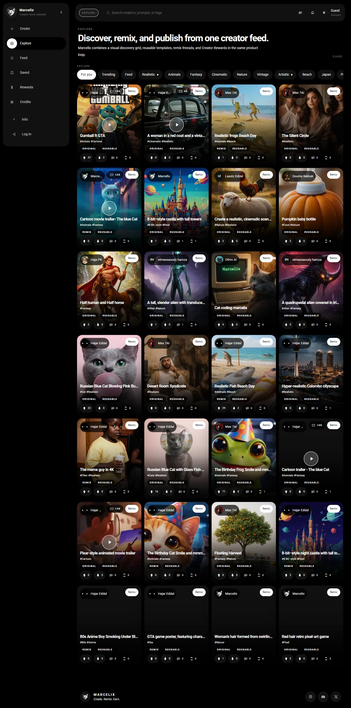
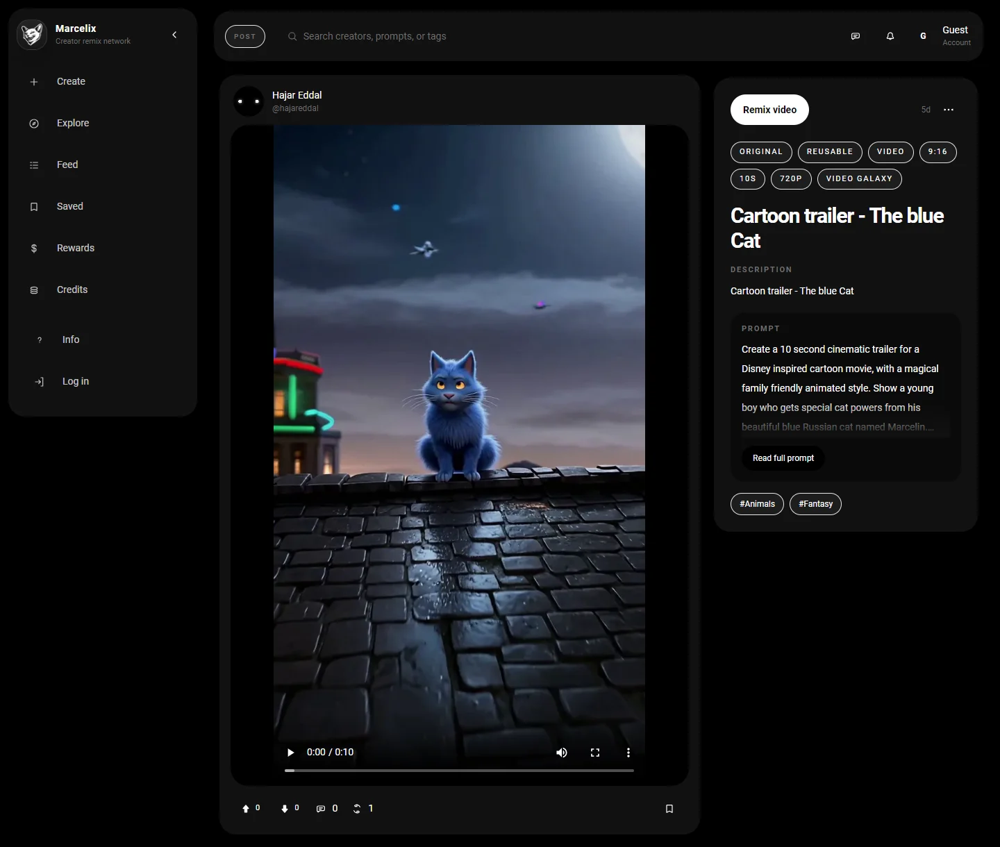
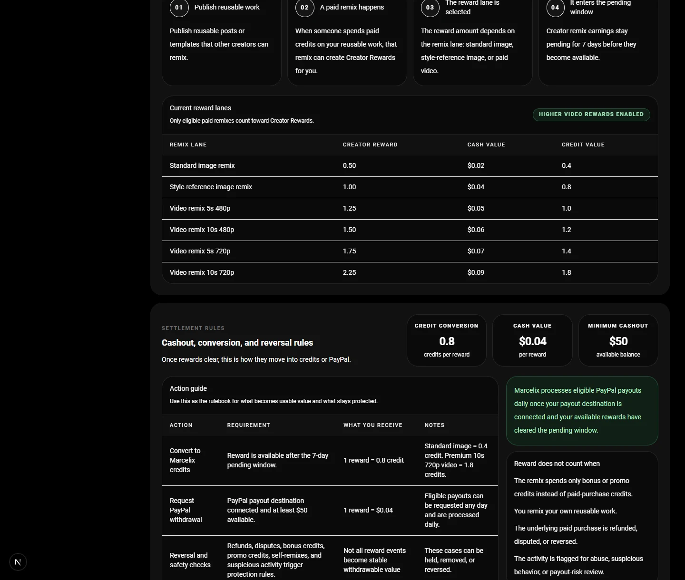

<p align="center">
  <a href="https://www.marcelix.com">
    
  </a>
</p>

<h1 align="center"><a href="https://www.marcelix.com">Marcelix</a></h1>

<p align="center">
  <strong>Create. Remix. Earn.</strong>
</p>

<p align="center">
  <a href="https://www.marcelix.com">marcelix.com</a>
</p>

---

Most AI apps stop too early.

A creator can make a great image or video, post it to a mainstream feed, get 50k views, and still walk away with almost nothing durable. No remix path. No attribution chain. No clean way for the next creator to build from it inside the same network. No real upside after the first upload.

[Marcelix] is built around a different idea:

> the post should stay alive after publication

Not as a file people export and forget. As a reusable source inside the network.

That changes the loop from:

```text
prompt -> output -> download -> repost -> disappear
```

to:

```text
private generation -> public post -> remix -> attribution -> profile growth
```

This repo is a short note on what [Marcelix] is, why it is shaped this way, and why creators keep coming back to it.

## Start Here

If you want to see the product object this README is talking about, open a real post:

- [cartoon trailer - The blue Cat](https://www.marcelix.com/post/fa85a896d0d2/hajareddal-cartoon-trailer-the-blue-cat)

That page is not just a media page. It is also the remix entry point.

## The Core Idea

In [Marcelix], the important object is not the raw prompt and not the exported file.

It is the public post.

Once a post is reusable, another creator can build from it directly inside the product. The source stays attached. The remix stays inside the graph. The original creator does not vanish the moment someone else uses the work.

That sounds simple, but it changes a lot:

- creators grow from strong posts, not only from follower luck
- remixing becomes native instead of hacked together through exports
- tags become real discovery surfaces
- prompt privacy and remixability can exist together

## What A Good Post Does Here

Suppose a creator publishes a strong stylized trailer, character post, or reusable visual format.

If that post lands well, three things happen at once:

1. it starts moving through `For You`, `Trending`, and tag discovery
2. it turns some viewers into followers
3. it becomes the starting point for direct remixes

That is the difference between a post that gets attention once and a post that keeps producing attention, remixes, and creator growth after it is published.

## Three Design Choices That Matter

### 1. Public does not automatically mean reusable

A post can be visible without becoming a remix source.

That matters because creators need control over what is simply published and what becomes upstream material for other people to build on.

### 2. Reusable does not automatically mean prompt leakage

This is a big one.

In many AI products, remixability and prompt exposure get tangled together. [Marcelix] separates them. A creator can let other people build from a work without turning the full hidden workflow into a public artifact.

That is one of the main reasons remix can exist here without collapsing into a race to leak prompts.

### 3. Tags are distribution, not decoration

Tags in [Marcelix] are not dead metadata.

They are search surfaces, follow surfaces, and niche pages. In a young network, an early good tag can become a real distribution channel for the creator who establishes it. That is especially useful for creators building recognizable styles, formats, or recurring characters.

## How Creators Grow

The growth loop is pretty direct:

- make something strong enough to stop the scroll
- publish it as a public post
- make it reusable if you want downstream remix demand
- let the feed and tag system do distribution
- turn viewers into followers
- turn strong source posts into remixes

That is why [Marcelix] feels different from a gallery. The best posts are not only nice outputs. They are starting points.

## Paid Remixes

This part is simple:

in [Marcelix], a paid remix pays the source creator.

The reward lane depends on what got remixed.

### Current reward lanes

| Remix lane | Creator Reward | Cash value | Credit value |
| --- | ---: | ---: | ---: |
| Standard image remix | 0.50 | $0.02 | 0.4 credits |
| Style-reference image remix | 1.00 | $0.04 | 0.8 credits |
| Video remix 5s 480p | 1.25 | $0.05 | 1.0 credits |
| Video remix 10s 480p | 1.50 | $0.06 | 1.2 credits |
| Video remix 5s 720p | 1.75 | $0.07 | 1.4 credits |
| Video remix 10s 720p | 2.25 | $0.09 | 1.8 credits |

### The short rulebook

- self-remixes do not count
- promo-only remixes do not count
- private drafts do not count
- non-reusable public posts do not count
- refunded, disputed, reversed, or abuse-reviewed activity can be corrected or removed

After rewards clear the pending window, creators can convert them into credits or request PayPal payout under the public rules shown in the product.

If you want the full payout and reversal rules, the live product page explains them better than a giant README ever should:

- <a href="https://www.marcelix.com/creator-rewards">marcelix.com/creator-rewards</a>

## Prompt Privacy

Prompt privacy is one of the hardest parts to get right in a remix product.

The line [Marcelix] draws is:

- posts can be public
- sources can be reusable
- hidden prompts can stay off the public surface
- remixers see their own remix-side work, not the creator's full hidden baseline

That line is the real product decision. It is what makes remixing useful without making every good post instantly copyable in the dumbest possible way.

## Model Lanes

[Marcelix] is not a one-model app.

Creators use different lanes for different jobs:

- fast image drafting
- polished image publishing
- reference-guided image work
- short video generation
- higher-end video lanes for stronger final clips

The point of the product layer is stability. Creators should be choosing based on output behavior, speed, format, and cost, not chasing upstream provider churn every month.

That is why the creator-facing lanes stay stable even while the backend evolves.

The live models page is the best place to see the current matrix:

- <a href="https://www.marcelix.com/models">marcelix.com/models</a>

## What The Screens Show

### Explore

The home feed is the first distribution layer.



This is where a post starts compounding. It gets discovered, it pulls profile visits, and if it is reusable it can become source material for more creation instead of dying as a one-off upload.

### Post page

The post page is where the object becomes real.



This is the remix entry point. The viewer remixes directly from the post, and the source creator stays attached automatically instead of losing the chain through exports and reposts.

### Rewards

The reward page is where the creator side becomes concrete.



This is where creators see the reward lanes, the conversion path, the payout path, and the actual rules that turn remix activity into money.

## Why People Sign Up

Creators do not need another place to dump AI outputs.

They need a place where:

- a strong post keeps working after it is published
- remixing is native
- attribution survives
- followers have a reason to stick
- paid remixes turn into creator rewards

That is the bet behind [Marcelix].

## If You Want To Dig More

- [Architecture note](./docs/architecture.md)
- [Creator rewards and payouts note](./docs/rewards-and-payouts.md)
- [Discovery, tags, and moderation note](./docs/discovery-tags-and-moderation.md)
- [Prompt privacy and model layers note](./docs/prompt-privacy-and-model-layers.md)
- [Security](./SECURITY.md)

## Links

- Product: <a href="https://www.marcelix.com">marcelix.com</a>
- Creator Rewards: <a href="https://www.marcelix.com/creator-rewards">marcelix.com/creator-rewards</a>
- Creator Rewards Policy: <a href="https://www.marcelix.com/creator-rewards-policy">marcelix.com/creator-rewards-policy</a>
- Help: <a href="https://www.marcelix.com/help">marcelix.com/help</a>
- Support: <a href="https://www.marcelix.com/support">marcelix.com/support</a>
- Models: <a href="https://www.marcelix.com/models">marcelix.com/models</a>
- Privacy: <a href="https://www.marcelix.com/privacy">marcelix.com/privacy</a>
- Terms: <a href="https://www.marcelix.com/terms">marcelix.com/terms</a>

[Marcelix]: https://www.marcelix.com
