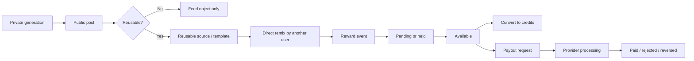

<p align="center">
  <a href="https://www.marcelix.com">
    
  </a>
</p>

<h1 align="center"><a href="https://www.marcelix.com">Marcelix</a></h1>

<p align="center">
  <strong>An AI-native social network for reusable images, short videos, remix chains, and creator rewards.</strong>
</p>

<p align="center">
  <a href="https://www.marcelix.com">marcelix.com</a>
</p>

---

Most AI apps stop at generation.

They produce an output, let the user download it, and lose the rest of the graph: reuse, attribution, follow-on discovery, and any economically meaningful link between the original work and the downstream work.

[Marcelix] is built around a different unit:

> a public, reusable post that can stay alive inside the network

That changes the loop from:

```text
prompt -> output -> download -> repost -> disappear
```

to:

```text
private generation -> public post -> reusable source -> remix -> attribution -> reward
```

This repository is a public product and systems overview for [Marcelix]. It documents the stable user-visible contract:

- the core objects
- the discovery model
- the reuse model
- the reward and payout rules
- the prompt privacy model
- the moderation and trust model
- the creator-facing behavior that stays stable even when internal providers change

It does **not** try to freeze internal provider payloads, anti-abuse thresholds, ranking weights, or back-office tooling as a public contract.
It is also not presented as a public developer API or provider integration spec.

## System Map



## Core Objects

| Object | Purpose | Public? | Can it earn? |
| --- | --- | --- | --- |
| Private generation | Draft image or video created before publishing | No | No |
| Public post | Main distribution unit in the feed and on profile pages | Yes | Only if reusable |
| Reusable post / template | Public post that other users can remix inside the product | Yes | Yes, if eligible paid remixes happen |
| Remix | A new generation created from a reusable source | Usually yes after publishing | The remixer does not pay the source creator automatically unless the remix is eligible and paid |
| Reward event | Ledger record created from an eligible paid remix | No | Yes, after settlement |
| Payout account | Creator payout destination record | No | Required for cash redemption |
| Payout request | Withdrawal request against available rewards | No | Becomes paid only after review and provider success |

## What [Marcelix] Optimizes For

[Marcelix] is not trying to optimize only for generation quality, or only for passive feed impressions.

It is optimizing for reusable creative supply:

- work that is strong enough to earn attention
- clear enough to establish a style or niche
- reusable enough to create downstream demand
- attributable enough to preserve the source creator
- defensible enough to support rewards without turning into spam

That is why the public post, not the raw prompt, is the main distribution object.

## Discovery And Growth

[Marcelix] has three public feed modes:

- `For You`
- `Trending`
- `Following`

Each one solves a different problem.

### `Trending`

`Trending` is about current motion, not all-time popularity.

The public ranking inputs include:

- net voting
- remix activity
- comment activity
- freshness
- age decay

The contract here is not a fixed formula. The contract is that `Trending` is supposed to reward current movement, not only historical size.

### `Following`

`Following` starts from explicit user intent:

- creators you follow
- tags you follow

Then it can add discovery backfill so the feed does not become sparse, repetitive, or fragile.

### `For You`

`For You` is the main creator-growth surface.

Conceptually it behaves like:

```ts
forYouFeed =
  diversify(
    postsFromFollowedCreators
    + postsFromFollowedTags
    + adjacentCreativeMatches(sharedTags, titleTerms, publicPromptTerms)
    + broaderDiscoveryBackfill
  )
```

What matters in public docs is the structure:

1. Start from direct follows.
2. Expand through adjacent creative work.
3. Prevent one creator or one cluster from flooding the page.

The hard public constraints matter more than the internal weights:

- public remixes only belong in the main discovery surface if they are themselves reusable
- one creator is capped before the feed falls back to looser diversity rules
- one cluster or near-duplicate family is capped before the feed widens again

That keeps the feed biased toward supply quality instead of derivative noise.

## Tags Are A Discovery Layer

Tags in [Marcelix] are not only passive metadata.

They act as lightweight discovery surfaces:

- users can add them to posts
- users can search them directly
- users can follow them directly
- tag pages can route attention back into a niche

There are two broad tag classes:

- platform-curated tags
- creator-originated tags

When a creator introduces a new tag, [Marcelix] can bind that tag back to the creator and show attribution such as `Created by @username` in the product.

That matters in a young network because an early creator can turn a good tag into durable profile distribution.

Important boundary:

- tag attribution is not permanent ownership
- [Marcelix] can rename, merge, feature, suppress, or remove tags
- generic, abusive, impersonating, or trademark-conflicting tags are not guaranteed stable attribution surfaces

The goal is discovery, not permanent tag property rights.

## What Reusable Actually Means

`Reusable` is a concrete product state in [Marcelix].

It means:

- the post is public
- the post is visible
- remix is enabled for that post
- another user can create a new generation from that source inside the product

It does **not** mean that every piece of the original creator workflow becomes public.

Reusable does not automatically expose:

- hidden source prompts
- every intermediate draft
- private prompt edits
- private reference history
- operational provider metadata

It means the post can function as an upstream remix source inside the network.

Important contract details:

- rewards attach to the **direct** reusable source used for the remix
- [Marcelix] does not publicly promise multi-hop revenue sharing across parent, grandparent, and origin chains
- creators can turn off future reuse for a post
- existing public remixes, reward events, and payout history remain part of the historical graph and accounting record

## Ownership And Remix Rights

At a product level, [Marcelix] separates:

- ownership of the creative work
- permission to remix inside the product
- platform rights to host and display public content
- reward rights tied to eligible paid reuse

The short version is:

- creators keep ownership of their work subject to the platform terms
- publishing grants [Marcelix] the rights needed to host, display, distribute, and promote public content inside the service
- marking a post reusable grants other users permission to remix that work **inside Marcelix**
- reward eligibility comes from the in-product reuse contract, not from transferring copyright ownership

If a creator later turns reuse off:

- new remixes stop
- existing public remixes do not disappear from history
- existing reward and payout records stay part of the accounting record

## Reward Model

Creator Rewards in [Marcelix] are an optional incentive layer on top of paid remix activity.

They are **not** wages, salary, or guaranteed income.

At a public-contract level, reward creation looks like this:

```ts
if (creatorUserId === remixerUserId) return 0

paidCreditPortion =
  sum(consumedLots where rewardFundingEligible === true)

if (paidCreditPortion <= 0) return 0

baseReward =
  mediaType === 'video'
    ? videoRewardLane(duration, quality)
    : referenceMode === 'style-only' && creditCost >= 2
      ? referenceReward
      : standardReward

rewardAmount =
  baseReward * min(1, paidCreditPortion / creditCost)

status =
  holdCheck ? 'held' : 'pending'
```

The important points are:

- self-remixes do not earn
- promo-only remixes do not earn
- mixed paid-plus-promo remixes can still earn, but only on the paid-credit portion
- image and video remixes are not flattened into one reward lane
- the system can hold events before they become available

For a remix to create reward value in the normal case, all of these need to be true:

- the source post is public and reusable
- another user performs the remix
- the remix uses at least some purchased credits that qualify for reward funding
- the remix resolves to a public reward lane
- the event survives the pending window and any risk review

## Public Reward Lanes

These are the current public reward lanes:

| Remix lane | Creator Reward | Cash value | Credit value |
| --- | ---: | ---: | ---: |
| Standard image remix | 0.50 | $0.02 | 0.4 credits |
| Style-reference image remix | 1.00 | $0.04 | 0.8 credits |
| Video remix 5s 480p | 1.25 | $0.05 | 1.0 credits |
| Video remix 10s 480p | 1.50 | $0.06 | 1.2 credits |
| Video remix 5s 720p | 1.75 | $0.07 | 1.4 credits |
| Video remix 10s 720p | 2.25 | $0.09 | 1.8 credits |

The point is not only the payout table. The point is that [Marcelix] recognizes different reuse lanes and prices them differently.

## Reward States And Payout States

Reward events and payout requests are separate objects.

### Reward event states

| State | Meaning |
| --- | --- |
| `pending` | Created, but still inside the settlement window |
| `held` | Created, but temporarily locked for risk or abuse review |
| `available` | Cleared and usable |
| `converted` | Converted into Marcelix credits |
| `requested` | Reserved into a payout request |
| `paid` | Included in a completed payout |
| `reversed` | Removed or offset after refund, dispute, reversal, or post-paid correction |

### Payout account states

| State | Meaning |
| --- | --- |
| `not_connected` | No payout destination on file |
| `pending` | Destination saved, but not yet fully usable for payout |
| `verified` | Destination is usable for payout submission |
| `restricted` | Destination or account is blocked from payout until review |

### Payout request states

| State | Meaning |
| --- | --- |
| `pending_review` | Internal review state reserved for requests that exist before queue submission |
| `submitted` | Accepted into the payout queue |
| `processing` | Claimed by the worker or in provider processing |
| `paid` | Provider confirmed success |
| `rejected` | Request failed or was denied |
| `reversed` | Request was paid, then later offset through a correction flow |
| `canceled` | Request was canceled before payout completion |

Current creator cashout requests normally enter `submitted` after eligibility checks pass. `pending_review` remains part of the broader state model for queue-control and manual handling paths.

## Cashout And Provider Reality

The payout path in [Marcelix] is:

1. Connect a PayPal payout destination.
2. Wait for that destination to become usable for payout.
3. Let rewards clear the pending window.
4. Submit a payout request.
5. Let the payout worker review reserves, request state, and provider outcome.

Current public cashout rules:

- pending window: `7 days`
- conversion rate: `1 reward = 0.8 credits`
- cash value: `1 reward = $0.04`
- minimum cashout: `$50`

Important public constraints:

- payout processing depends on provider availability, reserve health, request review, and payout status
- a completed payout is not treated as magically irreversible platform money
- if an underlying paid purchase is later refunded, disputed, or reversed, [Marcelix] can apply balance corrections, negative adjustments, payout restrictions, or future offset logic

So the safe public framing is:

> rewards can become withdrawable when eligibility requirements are met

not:

> every reward event is guaranteed cash

## What Does Not Count

These are the common cases where remix activity does not create stable reward value:

- private generations and non-public drafts
- public posts that are not reusable
- self-remixes
- remixes funded only by promo, bonus, or granted credits
- the promo-credit portion of a mixed paid-plus-promo remix
- remixes tied to purchases that are later refunded, disputed, or reversed
- activity held for abuse review, payout-risk review, or coordinated farming review

## Refunds, Reversals, And Negative Adjustments

The public rule is simple:

- unused paid credits can be removed from a reversed purchase
- linked reward events can also be reversed
- if already-converted or already-paid value needs to be corrected later, [Marcelix] can create a negative adjustment balance

That negative adjustment must be cleared before new conversion or new payout requests continue.

### Example

1. A user buys a paid credit pack.
2. The user spends part of that pack on remix activity.
3. Source creators receive pending reward events from the paid-credit portion.
4. Some of those reward events may later become available, converted, requested, or paid.
5. If the underlying purchase is later refunded, disputed, or reversed, [Marcelix] can unwind unused credits, reverse linked reward value, and, when needed, apply a negative adjustment to already-processed creator balances.

This is one reason [Marcelix] treats rewards as a settlement problem, not as instant cash.

## Reserve Safety

[Marcelix] does not treat gross purchases as free cash.

Before payout submission, the platform tracks reserve pressure across:

- unspent paid-credit liability
- pending reward liability
- held reward liability
- available reward liability
- requested payout liability
- payout-fee reserve

The public contract is not the exact reserve formula. The public contract is that creator payouts are constrained by paid-credit liabilities, reward liabilities, payout fees, and post-purchase reversal risk.

## Prompt Privacy

Prompt privacy is one of the main [Marcelix] product promises, but the promise is specific.

The public contract is:

- original posts can publish prompts as `public` or `hidden`
- hidden prompts are removed from the public post and template surface
- remix prompts are private by default
- remixers see their own edits, not the source creator's full hidden baseline
- hidden prompt text is not a public discovery surface

The public promise is **not**:

- local-only inference
- zero provider exposure
- a claim that all operational systems never touch prompt text

Like every hosted generation product, [Marcelix] has to send generation input to the model stack that produces the output. The privacy promise is about public exposure, remix boundaries, and access control, not about pretending the generation stack does not exist.

## Moderation And Trust

[Marcelix] moderates at multiple layers:

- prompt-time checks
- generation-time checks
- publication-time visibility
- community reports
- manual review

High-level public behavior:

- violating requests can be blocked before generation
- public posts can be reported
- heavily reported posts can be auto-hidden before manual review
- creators can request manual review
- admins can restore or remove after review
- reward and payout flows can be paused if abuse patterns or payout-risk patterns appear

That gives [Marcelix] a fast reaction path without pretending everything is fully automated or fully manual.

## Model Layer

`Marcelin` and `Video Galaxy` are product-facing model lane names inside [Marcelix].

They are not a promise that [Marcelix] owns a proprietary foundation model with that exact name.

The honest public description is:

- [Marcelix] uses leading external image and video model providers behind a product-controlled model layer
- the provider mix can change over time
- the product-facing lane names are the stable user surface
- the exact provider routing is operational, not the public API contract

What *is* stable for users is the lane behavior.

### Image lanes

- `Marcelin ULTRA`
- `Marcelin PLUS`
- `Marcelin FAST`

Supported image aspect ratios:

- `1:1`
- `4:5`
- `3:4`
- `16:9`
- `9:16`

Reference behavior:

- up to 3 image references
- each image reference adds 1 credit

### Video Galaxy

Supported frames:

- `16:9`
- `9:16`
- `1:1`
- `4:3`
- `3:4`
- `3:2`
- `2:3`

Supported output lanes:

- `5s 480p`
- `10s 480p`
- `5s 720p`
- `10s 720p`

Reference behavior:

- either visual guidance references or a single start frame

### Video Galaxy Pro

Supported frames:

- `16:9`
- `9:16`

Supported output lanes:

- `4s 720p`
- `8s 720p`
- `12s 720p`

Reference behavior:

- one guidance image or one start frame

## Public Surfaces

### Explore

The home feed is the discovery and reuse surface.


### Post page

A post page in [Marcelix] is both media distribution and an upstream remix node.


### Rewards and settlement

[Marcelix] exposes reward lanes, the pending window, conversion, and payout rules directly in the product.


## Public Docs In This Repo

- [Architecture](./docs/architecture.md)
- [Rewards and payouts](./docs/rewards-and-payouts.md)
- [Discovery, tags, and moderation](./docs/discovery-tags-and-moderation.md)
- [Prompt privacy and model layers](./docs/prompt-privacy-and-model-layers.md)
- [Security](./SECURITY.md)

## Links

- Product: <a href="https://www.marcelix.com">marcelix.com</a>
- Creator Rewards: <a href="https://www.marcelix.com/creator-rewards">marcelix.com/creator-rewards</a>
- Creator Rewards Policy: <a href="https://www.marcelix.com/creator-rewards-policy">marcelix.com/creator-rewards-policy</a>
- Help: <a href="https://www.marcelix.com/help">marcelix.com/help</a>
- Models: <a href="https://www.marcelix.com/models">marcelix.com/models</a>
- Public post example: <a href="https://www.marcelix.com/post/fa85a896d0d2/hajareddal-cartoon-trailer-the-blue-cat">cartoon trailer - The blue Cat</a>

[Marcelix]: https://www.marcelix.com
