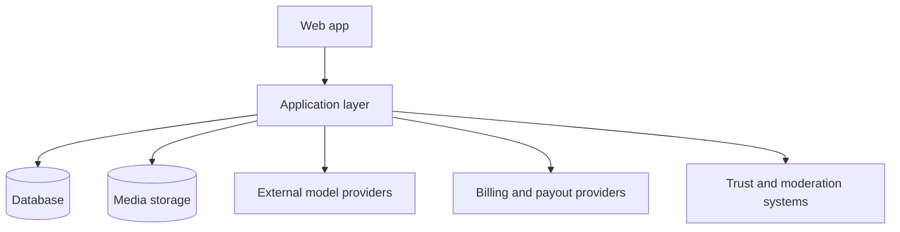

# [Marcelix] Architecture

This is the public architecture note for [Marcelix].

It describes the stable product structure and the creator-facing system shape.

## Scope

This public note covers:

- the main product objects
- what is public vs private
- how reuse, discovery, rewards, and payout fit together

It does not cover the operational implementation details that sit behind the public product contract.

## High-Level Components

At a public level, those components do the following:

| Component | Role |
| --- | --- |
| Web app | Creation, publishing, discovery, remixing, rewards UI, support flows |
| Application layer | Enforces visibility, permissions, reuse rules, rewards, and payout logic |
| Database | Stores posts, templates, tags, wallets, rewards, requests, reports, and profile state |
| Media storage | Stores public media and generated assets |
| External model providers | Generate image and video outputs |
| Billing and payout providers | Fund credits and process approved payout flows |
| Trust and moderation systems | Enforce safety, review, and abuse controls |

## Core Product Objects

The main objects are:

- private generations
- public posts
- reusable sources
- remixes
- creator rewards
- payout accounts
- payout requests

Those objects are deliberately separate because generation, publishing, reuse, rewards, and cash redemption are different states with different rules.

## Public Vs Private

| Object | Public surface | Private surface |
| --- | --- | --- |
| Private generation | None | Creator draft and generation context |
| Public post | Feed, profile, post page | Internal generation metadata |
| Reusable source | Remix entry point and public post state | Hidden prompt baseline and private context |
| Reward value | Public creator-facing totals and actions | Internal ledger detail and funding linkage |
| Payout request | Creator-facing request status | Provider submission detail and review history |

## Reuse Contract

A reusable post means:

- it is public
- it is visible
- remix is enabled
- other users can create new work from it inside [Marcelix]

It does not mean the full original workflow becomes public.

The reuse contract is about in-product remixability, not total disclosure.

## Why This Repo Stays Abstract

[Marcelix] documents the product contract publicly and keeps operational control logic internal.

That boundary is deliberate: the public repo should help users understand how the product behaves without turning into an implementation manual.

[Marcelix]: https://www.marcelix.com
