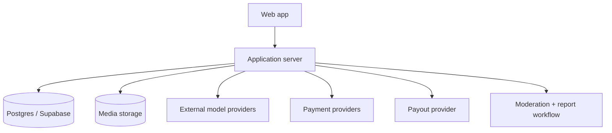
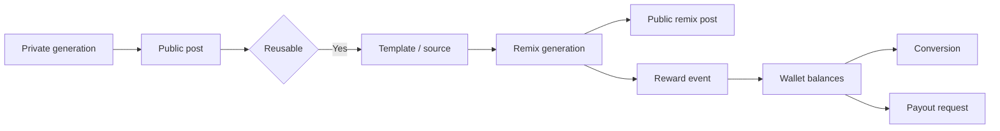

# [Marcelix] Architecture

This is the public architecture note for [Marcelix].

It documents the stable product contract, not every internal route, worker, or provider payload.

## Scope

The stable public contract is:

- what objects exist
- what states they move through
- what is public vs private
- how reuse, rewards, and payouts relate
- what creators and users can rely on without learning provider internals

The non-contract implementation details are:

- exact provider routing
- exact ranking weights
- exact anti-abuse thresholds
- internal admin tools
- internal database function names
- provider-specific API payload shapes

This repo is a public product architecture note, not a public SDK or provider integration manual.

## High-Level Components

At a public level, those components do the following:

| Component | Role |
| --- | --- |
| Web app | Publishing, discovery, remixing, rewards UI, payout requests |
| Application server | Enforces permissions, prompt visibility, reward rules, payout rules |
| Database | Stores posts, templates, tags, wallets, reward events, payout requests, reports |
| Media storage | Stores public media, previews, and generated assets |
| External model providers | Generate the actual image and video outputs |
| Payment providers | Fund credits through successful paid purchases |
| Payout provider | Sends approved creator payouts |
| Moderation/report workflow | Blocks unsafe inputs, hides risky posts, supports manual review |

## Core Object Graph

## Public Vs Private Surfaces

| Object | Public surface | Private surface |
| --- | --- | --- |
| Private generation | None | Creator draft |
| Public post | Feed, profile, post page | Internal generation metadata |
| Template / reusable source | Remix entry point, prompt only if explicitly public | Hidden prompt baseline, internal generation context |
| Reward event | Summary counts and wallet totals | Ledger row, funding link, status history |
| Payout request | Aggregate wallet state | Provider IDs, review state, settlement events |
| Report/moderation state | Hidden/visible outcome | Internal review reasoning and report detail |

## Reusable Object Contract

A reusable post in [Marcelix] means:

- the post is public
- the post is visible
- remix is enabled
- another user can create a new generation from it inside the product

It does not mean:

- the source creator's hidden prompt becomes public
- private drafts become public
- provider metadata becomes public
- the product promises multi-hop payout sharing across a remix chain

The public contract is direct-source remixability.

## Money-Related Objects

[Marcelix] separates these objects on purpose:

- credit purchase
- credit lot
- reward event
- reward wallet
- payout account
- payout request
- payout reversal / negative adjustment

That separation matters because credits, rewards, and payouts are not the same thing.

Examples:

- a user can have paid credits without ever creating a reward event
- a creator can have available rewards without requesting payout
- a creator can have a payout request without that request being paid yet
- a creator can have a negative adjustment after a post-paid correction

## Why The Docs Stay Abstract In Some Places

[Marcelix] documents the object model and state model publicly because those define the user contract.

It does not publish:

- exact fraud thresholds
- exact ranking weights
- exact provider failover logic
- exact moderation heuristics

Those are operational details, not stable user-facing guarantees.

[Marcelix]: https://www.marcelix.com
